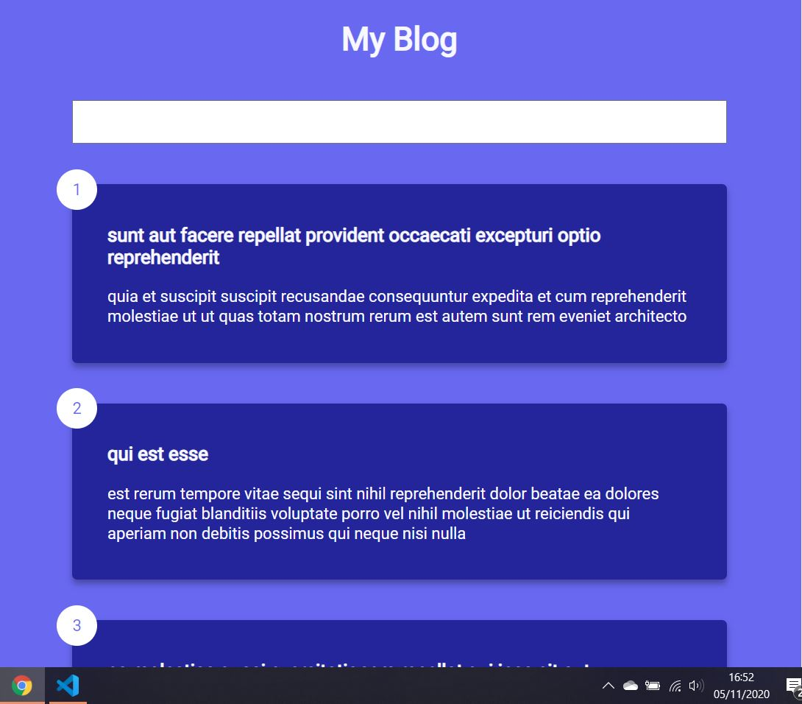

# Blog

Three posts are fetched from an [API](https://jsonplaceholder.typicode.com/) at a time and then rendered to the DOM.

Every time user scrolls to end, a CSS animated loading icon is displayed whilst more posts are fetched from the API and then rendered to the DOM.

